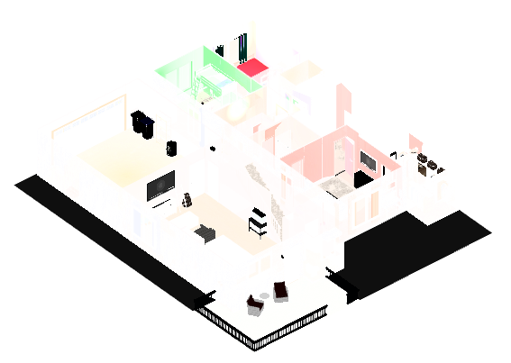

<a id="readme-top"></a>

<!-- PROJECT LOGO -->
<br />
<div align="center">
  <a href="https://github.com/johnnyo21/floorplan_3d">
    
  </a>

<h3 align="center">Floorplan 3D - A Home Assistant 3D Floorplan Card</h3>

  <p align="center">
    This card uses three.js to render a 3D model of your home exported from Sweet Home 3d or other software (.obj/.mtl). It is configurable to render your lights in real time by associating them with your light entities and placing the light sources in your model.
    <br />
    <a href="https://github.com/johnnyo21/floorplan_3d"><strong>View Demo »</strong></a>
    <br />
    <br />
    <a href="https://github.com/johnnyo21/floorplan_3d">Get Help</a>
    &middot;
    <a href="https://github.com/johnnyo21/floorplan_3d/issues/new?labels=bug&template=bug-report---.md">Report Bug</a>
    &middot;
    <a href="https://github.com/johnnyo21/floorplan_3d/issues/new?labels=enhancement&template=feature-request---.md">Request Feature</a>
  </p>
  <br />
  <a href="https://www.buymeacoffee.com/johnnyo21" target="_blank"></a>
</div>


<!-- ABOUT THE PROJECT -->
## About The Project

<div align="center">
  <a href="https://github.com/johnnyo21/floorplan_3d">
    
  </a>
</div>


### Built With

* Three.js - <a href="https://threejs.org">threejs.org</a> - Open Source 3d javascrypt library
* Home Assistant - <a href="https://homeassistant.io">homeassistant.io</a> - Open Source Home Automation Software

<p align="right">(<a href="#readme-top">back to top</a>)</p>


<!-- GETTING STARTED -->
## Getting Started

<h3>First things first, you will need a 3d model of your home. </h3>
<p>An eazy way to get started is with <a href="https://www.sweethome3d.com/">Sweet Home 3D (FREE SOFTWARE)</a> - Google some tutorials or videos to help you get started.
<br />
Alternatively, you can use any other 3d design software as long as you can export your models in (.OBJ / .MTL) format.</p>

### Prerequisites

Once you have the model of your home completed using Sweet Home 3D.
* (OPTIONAL) Navigate to 3D view --> Modify 3D view --> Walls transparency --> Drag the Slider slightly to the right to add a little transparency to your models walls.
* Navigate to 3D view --> Export to OBJ format --> Save the files (OBJ - Wavefront) to a folder on your computer. (Save as floorplan.obj or something similar)
* Confirm you now see in this folder floorplan.obj, floorplan.mtl and any texture image files associated with your model.
* Access the www folder inside of home assistant. Create a new folder inside of this directory and copy all of these files over `/www/floorplan/YOUR_EXPORTED_FILES`


### Installation

Using HACS (RECOMMENDED)

1. If HACS is not installed yet, download it following the instructions @ <a href="https://hacs.xyz/docs/setup/download/">hacs.xyz</a>
2. Navigate to HACS in the sidebar of your home assistant dashboard and click on the 3 dots in the upper right corner of the screen. Navigate to "Custom repositories".  A dialog should appear with 2 input fields. Under Repository enter the github url below and under the Type dropdown select "Dashboard".
   ```sh
   https://github.com/johnnyo21/floorplan_3d/
   ```
3. Search for "Floorplan 3D" in HACS, Open the Description and Click on the Download button appearing in the bottom right corner of the screen. Click Reload when prompted.

   <br />
Manual Installation

1. Download the most recent version of `floorplan-3d-card.js` from Github and copy it to `/www/floorplan/` on your home assistant installation. 
  
2. Navigate to Settings --> Dashboards in Home Assistant.  Click the 3 dots in the upper right corner and navigate to "Resources".

3. Click "Add Resource" and enter the url: `/floorplan/floorplan-3d-card.js` and ensure JavaScript module is selected.
   
4. Restart Home Assistant.

<p align="right">(<a href="#readme-top">back to top</a>)</p>


<!-- USAGE EXAMPLES -->
## Usage

1. Navigate to the Dashboard that you want to add your floorplan to.
2. Edit the dashboard and add a new card.  When prompted search for or scroll down to "3D Floorplan Card" and add it to your dashboard.
3. In the card configuration you will need to direct the card to your .obj model (see prerequisites above).  Be sure your filenames match what you have saved in the `/www/floorplan/` directory. 
   ```sh
   type: custom:floorplan-3d-card
   obj_path: /local/floorplan/floorplan.obj
   mtl_path: /local/floorplan/floorplan.mtl
   ```
4. Save the card and ensure that your model is loading properly on your dashboard.
5. Now to add our light entities to our model. Edit the card and add the following under our file paths in the yaml configuration. Save the Card
   ```sh
   debug_mode: true
   ```
6. Open your browsers Developers Console (F12 on your Keyboard or Right Click and Select Inspect Element) .. Click on Console and Refresh the Page.
7. Ensure you are looking at your model from the top down and click on the floor where you would like to add a light source in a room.
8. You should see in the debug console a message that reads: `[FLOORPLAN DEBUG] Click coordinates: position: { x: 505.110, y: 0.000, z: 572.587 }` Write that down with the associated light name. You can keep clicking on other lights and record them or proceed to adding your light via yaml below. 
9. Edit the card again: Add the following under `debug_mode:` Change the X and Z coordinate to match the values you have written down and adjust the Y coordinate to the height of the light in the space.  Start with 230 for 8-9 foot walls and adjust from there if needed. You should see a Red Dot Appear on your model indicating the location of your new light source.  Save the Card. 
   ```sh
   light_map:
    - entity_id: light.YOUR_LIGHT_ENTITY
      position: { x: 505, y: 230, z: 572 }
   ```
10. The light in your model should now be followng the associated light entity.  It will turn on/off and if dimmable or RGB will follow the brightness and color of the light as well. Edit the configuration to `debug_mode: false` once you have added all of your light sources.  (Note: if you have several lights or a complex model, try adding the lights via the "Raw Configuration Editor" to save loading time between edits)
11. Additional Configuration:
   * ambient_light_intensity: X.X - OPTIONAL - changes the ambient light shining on the model - (eg. 0.1 is very dark, 0.9 is very bright)
   * intensity: X.X - OPTIONAL - changes a light entities brightness offset. (eg. 1.4 would make the light 40% brighter than its current brightness, 50% x 1.4 = 70%)
   * color: "0xffefcd" - OPTIONAL - changes the color of the light if the light source is not RGB.

13. Example Configuration:
   ```sh
   type: custom:floorplan-3d-card
   obj_path: /local/floorplan/floorplan.obj
   mtl_path: /local/floorplan/floorplan.mtl
   debug_mode: false
   ambient_light_intensity: 0.4
   light_map:
    - entity_id: light.YOUR_LIGHT_ENTITY_1
      color: "0xffefcd"
      intensity: 1.4
      position: { x: 505, y: 230, z: 572 }
    - entity_id: light.YOUR_LIGHT_ENTITY_2
      color: "0xffefcd"
      position: { x: 105, y: 230, z: 950 }
   ```

<p align="right">(<a href="#readme-top">back to top</a>)</p>


<!-- ROADMAP -->
## Roadmap

- [X] Associate Light Sources with Light Entities and Track State, Brightness, Color.
- [ ] Associate Door and Window Positions with Door and Window Switch Entities and Track State.
- [ ] Associate Ceiling Fan and Exhaust Fans with Fan Entities and Animate based on State.
- [ ] Associate Misc. Entities (ie. temperature, alarm, motion, etc.)
- [ ] Optimize Performance with Large Models
    - [ ] Compress and Optimize for Web the Model itself. 

See the [open issues](https://github.com/github_username/repo_name/issues) for a full list of proposed features (and known issues).

<p align="right">(<a href="#readme-top">back to top</a>)</p>


<!-- LICENSE -->
## License

Distributed under the MIT License. See `LICENSE.txt` for more information.

<p align="right">(<a href="#readme-top">back to top</a>)</p>
